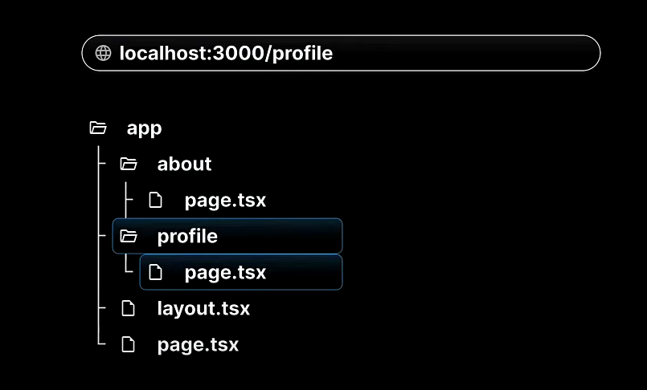

# Next js

* Whatu is Next.js?

`React.js`

* It's not feasible to create a fully-featured application ready for production
* React is a library for building user interfaces
* You need to make descision about other features such as routing,data featching and more.

`Next.js`

* It uses react for building user interfaces
* Provides additional features that enables you to build production-ready application.
* These feature includes routing,optimized rending,data fetching,bundling,compiling and more.
* You don't need to install additional package as Next.js provides everything you need.
* Opinions and conventions should be followed to implement therse features.
* Next.js is framework of React.js

## Why need Next.js?

Next.js simplifies the process pf building a web application for production.

1. Routing
2. API routes
3. Rendering
4. Data fetching
5. Styling
6. Optimization
7. Dev and prod build system

## Prerequisites

* HTML,CSS and javascript
* ES6+ features
* React.js

## Getting Started

```bash
npx create-next-app@latest 
```

```bash
√ What is your project named? ... hello-world
√ Would you like to use TypeScript? ... No / Yes
√ Would you like to use ESLint? ... No / Yes
√ Would you like to use Tailwind CSS? ... No / Yes
√ Would you like to use `src/` directory? ... No / Yes
√ Would you like to use App Router? (recommended) ... No / Yes
√ Would you like to customize the default import alias (@/*)? ... No / Yes 
```

## React Server Components(RSC)

React Server Components is a new architecture introduce by the react team in versio 18 which was quickly embraced by next.js

The Architecture introduces a new way of creating React Components,splitting them into types:

1. Server Components

    * In next.js all components are server components by default.
    * They have the ability to run tasks like reading files pr fetching data from a database.
    * However,they don't have the ability to use hooks or handle user interactions.

2. Client Components
   * to create a Client Components,it's necessary to add "use client: at the top of the components file.
   * Client components can't perform tasks like reading files,but they have the ability to use hooks and manage interactions.
   * Client components are rendered on the client-side.

## Routing

* Next.js has file system based routing mechanism.
* URL ppaths that users can access in the brower are defined by files and folders in your codebase.

### Routing Conventions

* All routes must be placed inside the app folder.
* Every file that corresponds to a route must be named `page.js` or `page.tsx`.
* Evry folder corresponds to a path segment in the bowser URL.


